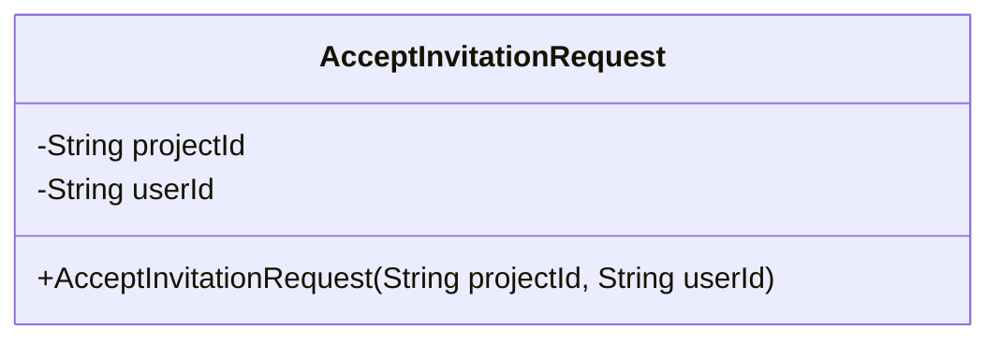
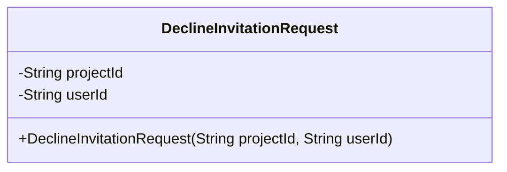
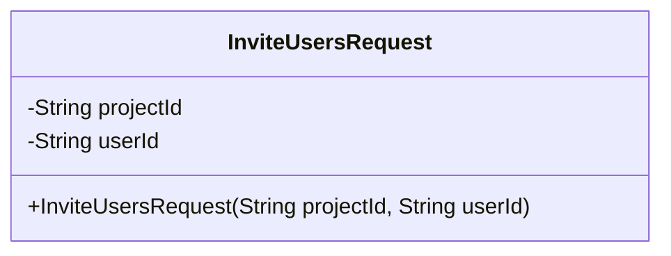
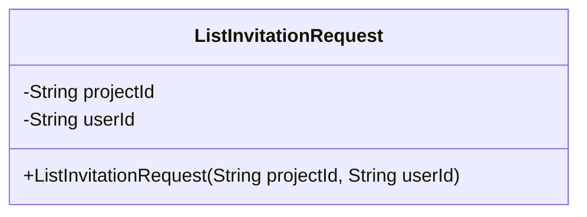
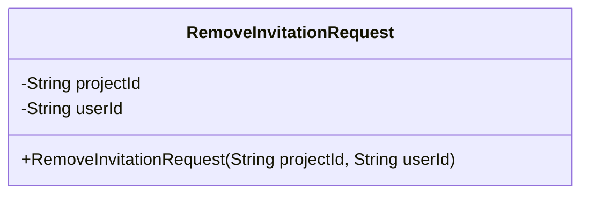
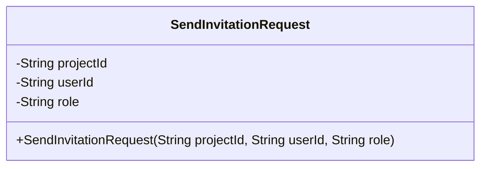
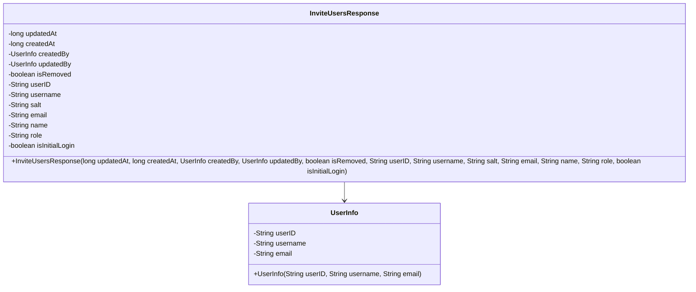
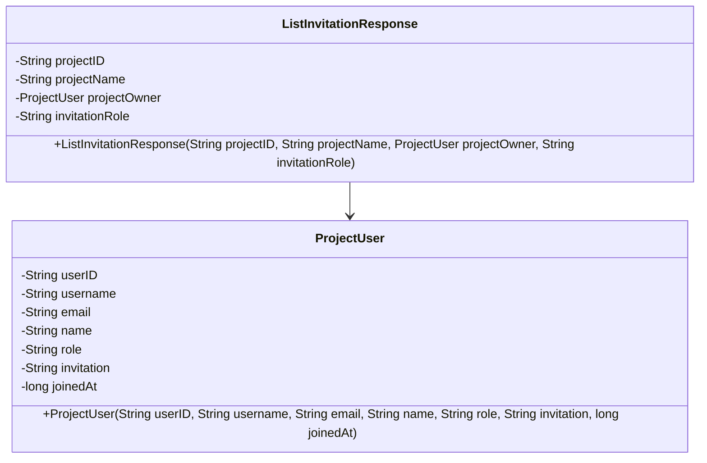

# Invitation Request

```mermaid
classDiagram
    class AcceptInvitationRequest {
        -String projectId
        -String userId
        +AcceptInvitationRequest(String projectId, String userId)
    }
```

```mermaid
classDiagram
    class DeclineInvitationRequest {
        -String projectId
        -String userId
        +DeclineInvitationRequest(String projectId, String userId)
    }
```

```mermaid
classDiagram
    class InviteUsersRequest {
        -String projectId
        -String userId
        +InviteUsersRequest(String projectId, String userId)
    }
```

```mermaid
classDiagram
    class ListInvitationRequest {
        -String projectId
        -String userId
        +ListInvitationRequest(String projectId, String userId)
    }
```

```mermaid
classDiagram
    class RemoveInvitationRequest {
        -String projectId
        -String userId
        +RemoveInvitationRequest(String projectId, String userId)
    }
```

```mermaid
classDiagram
    class SendInvitationRequest {
        -String projectId
        -String userId
        -String role
        +SendInvitationRequest(String projectId, String userId, String role)
    }
```

# Invitation Response

```mermaid
classDiagram

    class InviteUsersResponse {
        -long updatedAt
        -long createdAt
        -UserInfo createdBy
        -UserInfo updatedBy
        -boolean isRemoved
        -String userID
        -String username
        -String salt
        -String email
        -String name
        -String role
        -boolean isInitialLogin
        +InviteUsersResponse(long updatedAt, long createdAt, UserInfo createdBy, UserInfo updatedBy, boolean isRemoved, String userID, String username, String salt, String email, String name, String role, boolean isInitialLogin)
    }

    class UserInfo {
        -String userID
        -String username
        -String email
        +UserInfo(String userID, String username, String email)
    }
    InviteUsersResponse --> UserInfo
```

```mermaid
classDiagram
    class ListInvitationResponse {
        -String projectID
        -String projectName
        -ProjectUser projectOwner
        -String invitationRole
        +ListInvitationResponse(String projectID, String projectName, ProjectUser projectOwner, String invitationRole)
    }

    class ProjectUser {
        -String userID
        -String username
        -String email
        -String name
        -String role
        -String invitation
        -long joinedAt
        +ProjectUser(String userID, String username, String email, String name, String role, String invitation, long joinedAt)
    }
    ListInvitationResponse --> ProjectUser
```
